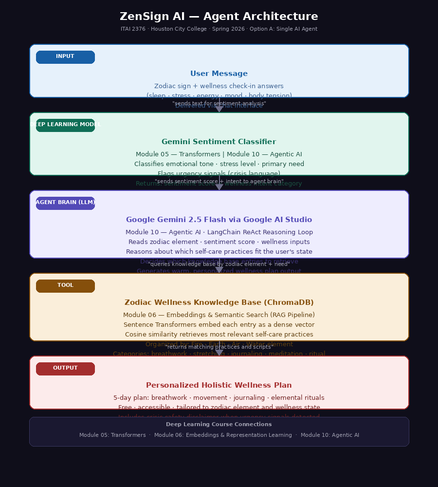

# ZenSign AI: Zodiac-Guided Holistic Wellness Agent
> A free AI wellness companion for people who cannot afford self-care services.

## Project Info
- Solo Project — Christen Robinson
- ITAI 2376 · Houston City College · Spring 2026

## Problem & Target User
Millions of Americans experience chronic stress and anxiety but cannot 
afford professional self-care services like massage therapy or yoga classes. 
ZenSign AI provides free personalized wellness plans to anyone with a phone 
or computer — including hourly workers, students, and caregivers.

## Option Chosen
Option A: Single AI Agent (same as Midterm blueprint no changes)

## How It Works
ZenSign AI greets the user, collects their zodiac sign, and asks 5 wellness 
check-in questions about sleep, stress, energy, mood, and body tension. It 
then uses Google Gemini to analyze the user's emotional tone and retrieves 
relevant self-care practices from a ChromaDB knowledge base organized by 
zodiac element. Finally it generates a personalized free 5-day wellness plan 
including breathwork, movement, journaling, and elemental rituals.

## Architecture Diagram

## Frameworks and Tools Used
- LangChain (agent framework)
- Google Gemini 1.5 Flash via Google AI Studio (LLM brain)
- ChromaDB (vector knowledge base)
- Google Gemini (sentiment classifier — replaces original BERT plan)
- Sentence Transformers (embeddings)

## Installation
pip install -r requirements.txt

## How to Run
Open agent.ipynb in Google Colab and run all cells in order.
Add your GOOGLE_API_KEY to Colab Secrets before running.

## Example Usage

Example 1 — Scorpio user with high stress:
- User says: "I am a Scorpio. My stress is a 9 and I cannot sleep."
- Agent returns: 5-day Water element grounding and breathwork plan

Example 2 — Aries user with low energy:
- User says: "I am an Aries. My energy is a 2 and I feel burned out."
- Agent returns: 5-day Fire element restoration and movement plan

Example 3 — Virgo user with poor sleep:
- User says: "I am a Virgo. I score my sleep a 3 and feel anxious."
- Agent returns: 5-day Earth element calming and journaling plan

## Known Limitations
- The free Gemini API tier has daily quota limits which can interrupt 
  testing if too many calls are made quickly
- The knowledge base has 50-200 entries and may not cover every 
  specific wellness need
- The agent does not store user history between separate sessions
